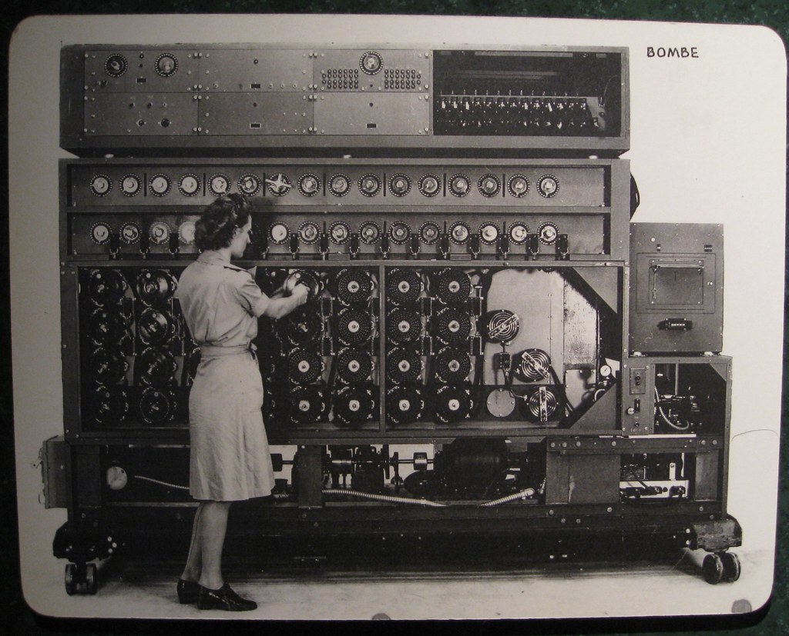
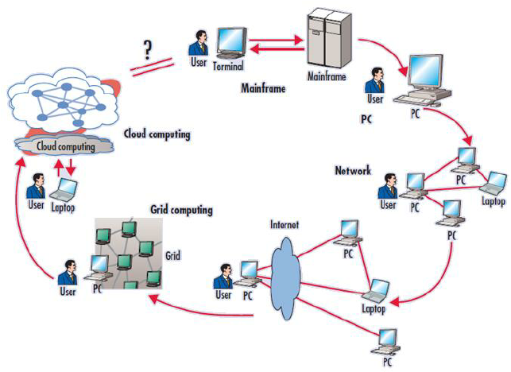
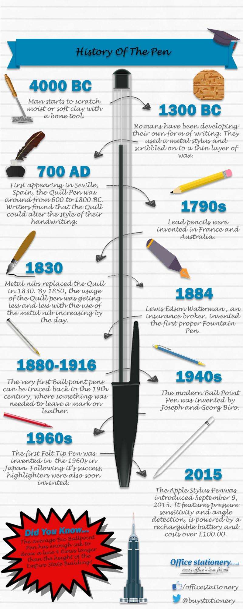

# Technical Change

---
[.text: #feffff]
[.header: #feffff]

# The only constant is change

All change is disruptive, there will always be the leaders,  the followers,  and the nay sayers.
If you don't agree, support your argument with facts & data.

^ Speaker Note
You've heard the old adage the only constant is change..

---

# The Human Component & 
##Adoption

*Moffett Field*

---

## The Human Component
I'll focus on Technical Change but it is important to remember that technical change often leads to organizational change. 
Often that is the most challenging.
- Stanford Business School
- Ames Research Center at Moffettt Field
- JPL 

---
[.text: #feffff]
[.header: #feffff]
# Immediacy

Tremendous driving force.

- Film to Digital
- Wired to Wireless
- Messages, Voicemail,  Pagers, Texts,  Rich Cross Platform "Texting"
- spatial applications -> Thomas Guides, MapQuest on your computer,  portable GPS and Maps

Sometimes immediacy results in a tradeoff  more important than quality

---
[.text: #feffff]
[.header: #feffff]

## Change does not always take hold the first time

---

## Change is not only disruptive but cyclical

The Change Pendulum
- Mainframes >  PCs > Cloud > Table (college freshman talked into tablet rather than a laptop)
Centralized/distributed
- LateX Word Markdown

---
# Managing Change & Adoption

Throughout your career you will likely be both the changer and the changee.

In my experience the most important questions to ask are:

- What problem am I trying to solve? 
- Which forces are in play? 
- When is the time to change?

---

# Tools#

--- 

# The bigger picture

- Tools can help achieve excellence in your disciple 
- Be open to technical change 
- Cultivate the skills to manage change

^ Speaker Note
Looking at a network engineer in 2021.

---
# Discussion

