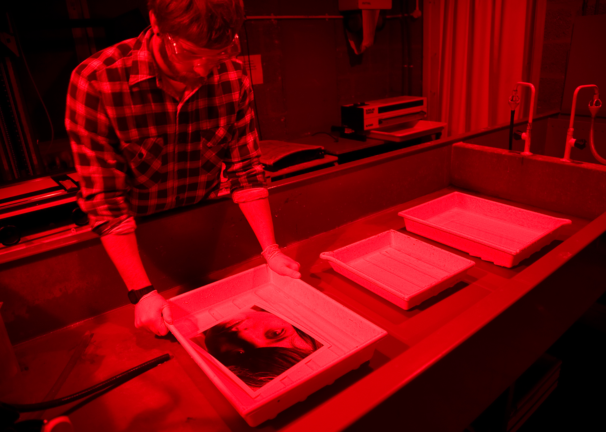

# Technical Change

---

# The only constant is change

All change is disruptive, there will always be the leaders,  the followers,  and the nay sayers.
If you don't agree, support your argument.

^ Speaker Note
You've heard the old adage the only constant is change..

---

# The Human Component
Moffett Field

---

## The Human Component
I'll focus on Technical Change but it is important to remember that technical change often leads to organizational change. 
Often that is the most challenging.
- Stanford Business School
- Ames Research Center at Moffettt Field
- JPL 

---

# Immediacy

Tremendous driving force.

- Film to Digital
- Wired to Wireless
- Messages, Voicemail,  Pagers, Texts,  Rich Cross Platform "Texting"
- spatial applications -> Thomas Guides, MapQuest on your computer,  portable GPS and Maps

Sometimes immediacy results in a tradeoff  more important than quality

---

## Change does not always take the first time

---

## Not only disruptive but cyclical

The Pendulum
- Mainframes >  PCs > Cloud > Table (college freshman talked into tablet rather than a laptop)
Centralized/distributed
- LateX Word Markdown

---

# Managing Change & Adoption
In your career this will be a challenge both as an individual and very likely in your chosen field.

---

# Tools

--- 

# The bigger picture
- These are tools and they can't substitute excellence in your disciple...they can help tremendously
- Be open to technical change
- Up to you to use them to make your life easier or not

Be open to it, see if it makes your job easier,  is it its time? 

---
# Discussion

